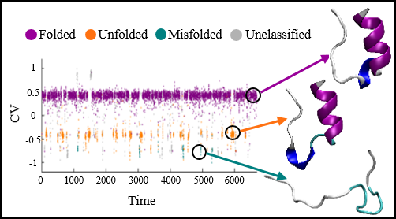

  

**About:**

This repository contains the code framework and results of the paper **"A Stochastic Landscape Approach for Protein Folding State Classification"**, written by Michael Faran, Dhiman Ray, Shubhadeep Nag, Umberto Raucci, Michele Parrinello, and Gili Bisker.
The paper can be found here: <https://pubs.acs.org/doi/full/10.1021/acs.jctc.4c00464>.

The paper introduces the Stochastic Landscape Classification (SLC), an innovative, automated, non-learning algorithm that classifies protein folding dynamics trajectories into different macro-states – dwelling epochs met along the protein's folding pathway. This is achieved by classifying collective variables (CVs) trajectories – low-dimensional representations of complex dynamical systems like molecular dynamics (MD) of macromolecules. The SLC segments the CVs into distinct macro-states, revealing the protein folding pathway realized by MD simulations. The segmentation is achieved by analyzing changes in CV trends, and clustering these segments using a standard density-based spatial clustering of applications with noise (DBSCAN) scheme.

This code was written by Michael Faran, 28/3/2024. For any questions or inquiries, please send an email to: <faranmic@mail.tau.ac.il>

**Software Requirements:**

- MATLAB version 23.2 (product number 1) is required.
- **Statistics and Machine Learning Toolbox** (product number 19) is highly recommended (might work with previous versions but not guaranteed).

**Installation:**
- Clone or download the repository to a chosen folder.
- Download the external dependencies and install the BEAST algorithm (see below for more details).
- Add the dependecies (including the BEAST folder) to the repository chosen folder. 
- Activate the main script "Protein_state_classification.m" from the repository chosen folder for the two given protein examples. 
  The default is Trp-Cage, but it can be changed to Chignolin as well (see in the "Protein_state_classification.m" script user inputs section).
- Following the main script, adjust and check the algorithm for your own data.

**External Dependencies:**

Download the following .m files to the main folder:

- **nmi.m:** <https://www.mathworks.com/matlabcentral/fileexchange/29047-normalized-mutual-information>
- **Knee\_pt.m:** <https://www.mathworks.com/matlabcentral/fileexchange/35094-knee-point>
- **munkres.m:** <https://www.mathworks.com/matlabcentral/fileexchange/20328-munkres-assignment-algorithm>
- **clustering\_comparison.m:** <https://www.mathworks.com/matlabcentral/fileexchange/45222-hierarchical-cluster-comparison>

**BEAST Algorithm Setup:**

1. Download and install the BEAST algorithm .m files following the instructions here: <https://www.mathworks.com/matlabcentral/fileexchange/72515-bayesian-changepoint-detection-time-series-decomposition?s_tid=FX_rc1_behav>
2. Ensure that the BEAST algorithm can be accessed from the chosen folder, and if needed, add it to the MATLAB path.

**User Inputs:**

All user inputs are assumed to be located in the 'Main' folder:

- **CV\_Matrix\_name:** An N\*M matrix, where N is the CV trajectory length and M is the number of CVs to segment.
- **M:** The number of CVs of interest (explicitly enter the value).
- **DSI:** The downsample index (CV needs to be under 10000 samples for BEAST to converge reasonably).
- **Ground Truth CV-vector:** A 1\*N vector representing the protein's state for each sample. Values correspond to states (e.g., "Folded" = 1, "Unfolded" = 2, "Misfolded" = 3). The name of the vector should be "ground\_truth\_vec" within the loaded structure. "0" represents unclassified samples.
- **Protein\_name:** A string containing the protein name (e.g., Chingolin, Trp Cage).
- **N\_states:** The number of protein states in the ground truth vector.

**Code Outputs (per CV):**

Assuming the protein name is "Protein\_name":

- **BEAST\_RAW\_Protein\_name\_New\_i.png:** Raw CV data figure with BEAST-detected trend changepoints.
- **SLM\_Clustering\_Protein\_namen\_New\_No\_color\_i.png:** Stochastic landscape after PCA and normalization (no cluster color marks).
- **Stochastic\_Landscape\_Unnormalized\_Matrixi.mat:** Raw segment data of segment stochastic coordinates for CV i.
- **SLM\_Clustering\_Protein\_name\_New\_i.png:** Stochastic landscape after PCA and normalization (with cluster color marks).
- **Stochastic\_Landscape\_PCA\_Matrixi.mat:** PCA result on normalized segment data (projected later).
- **BEAST\_Summary\_Protein\_name\_New\_i.png:** CV data clustered using DBSCAN, with vertical lines indicating BEAST-detected changepoints.
- **CV\_vs\_time\_Protein\_name\_New\_i.png:** Protein state labeling using the Kuhn-Munkres algorithm applied to DBSCAN results, projected onto the original CV trajectory (main output).
- **BEAST\_Summary\_Protein\_name\_New\_i\_workspace.mat:** MATLAB workspace at the end of the run for CV i.
- **Truth\_mat.mat:** Combined output of all classification matrices (NMI, RI, ARI, Dice, FM, Jaccard) compared to the ground truth. Rows correspond to CVs by their order in the input matrix ("CV\_Matrix\_name").

**Additional Information:**

- Refer to the paper for more details: "A Stochastic Landscape Approach for Protein Folding State Classification" by Michael Faran et al.
- See the repository: <https://github.com/luigibonati/deep-learning-slow-modes>

**References:**

- The code uses the BEAST algorithm as a baseline: <https://www.sciencedirect.com/science/article/pii/S0034425719301853>
- In conjunction with the Stochastic Landscape:

  <https://www.pubs.acs.org/doi/full/10.1021/acs.jpcb.3c01376>

- On protein folding MD collective variables data, published in:

`     `Chingolin- <https://www.pnas.org/doi/abs/10.1073/pnas.2113533118>

`     `Trp-Cage- <https://pubs.aip.org/aip/jcp/article/158/20/204102/2891484>

